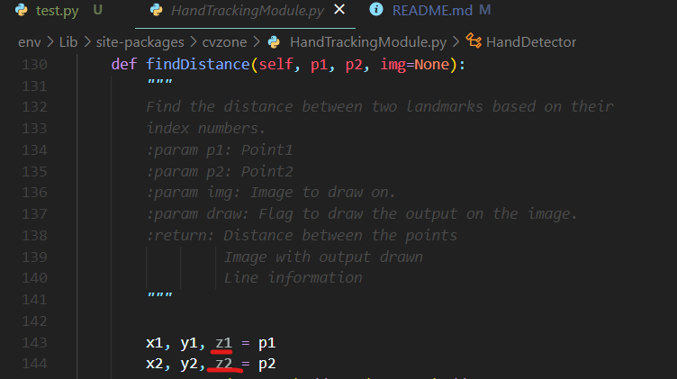

<h1>just-move-it</h1>

#### a school project for just dance clone

<br/>

---
## How to setup and enter env
* python -m venv env
* .\env\Scripts\activate
* python -m pip install -r requirements.txt

## Start the program with main.py


## Koro ca c'est pour toi.
En gros le fichier test.py contient le truc fonctionnel  
Il faut que tu télécharge avec pip :
 - cvzone
 - mediapipe
 - opencv-python
 - numpy

#### Et après ça faut que tu aille dans le fichier ```.\env\Lib\site-packages\cvzone\HandTrackingModule.py``` (si tu utilise un env oublie pas de faire .\env\Scripts\activate) et que tu modifie de la sorte :

<br/>



Car si on le fait pas il n'arrive pas a extraire le tuple contenue dans p1 et p2 (donc erreur; je me suis un peu cassé la tête dessus)

Après (tjr dans le env) tu peux faire ```python ./test.py``` et ça fonctionne normalement


<br/>
<br/>

# Attention ⚠️

Si les json sont corrompu par ``\xa0`` (souvent git qui change car incompatibilité linux vs windows) lance le programme ``reparerquizz.py`` qui va automatiquement les réparer

---
## TODO:
* Find a great idea